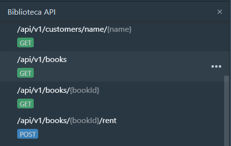

# Desafio

O presente projeto foi criado com base no [template da Wiz Soluções](https://github.com/wizsolucoes/api-wiz-template) para construção de APIs

Dentro da pasta de Documentação temos uma especificação de API no formato OpenAPI v3, queremos uma API construida seguindo essa especificação.

O projeto já implementa a parte do customers, mas a parte dos Books ainda não foi implementado.

Existem 3 rotas ainda por fazer.

- Listar livros
- Recuperar livro pelo Id Open Library
- Alugar livro para o usuário autenticado

Para recuperar as informações sobre livros recomendo utilizar o serviço [Open Library Books API](Open-Library-Books-API.md)

Para cada um desses serviços precisamos criar teste unitario, de integração, de compomente e de contrato.