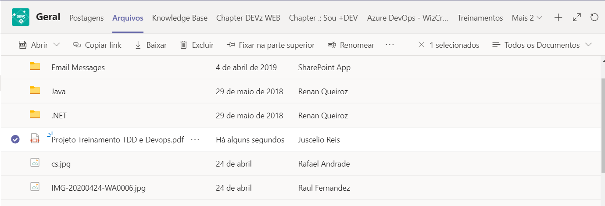

# Desafio

O presente projeto foi criado com base no [template da Wiz Soluções](https://github.com/wizsolucoes/api-wiz-template) para auxiliar a execução do desafio de TDD.

Dentro da pasta de Documentação temos uma especificação de API no formato OpenAPI v3, queremos uma API construída seguindo essa especificação.

Esse projeto já implementa a parte do customers para auxiliar com exemplos de como realizar os testes e como implementar as tasks do desafio, mas a parte do Book ainda não foi implementado.

Existem 3 rotas ainda por fazer.

- Listar livros
- Recuperar livro pelo Id Open Library
- Alugar livro para o usuário autenticado

Para recuperar as informações sobre livros recomendo utilizar o serviço [Open Library Books API](Open-Library-Books-API.md)

Para cada um desses serviços precisamos criar teste unitário, de integração, de componente e de contrato.

## Roteiro para execução

- Criar PBI do Seu Projeto
- Criar Projeto
- Criar a branch
- Configurar o projeto Backend
- Configurar o Pipeline do projeto
- Fazer Commit do Projeto
- Criar a Release do Projeto
- Solicitar Pull Request para a Master
- Revisar PR
- Realizar QA
- Aprovar Para ProD

Para realizar essa etapa existe um pdf no teams com os detalhes de como realizar cada etapa.

## Roteiro para o desenvolvimento

Precisamos implementar 3 endpoints, sendo eles:

- Listar livros
  - Modelar domínio do 'Listar livros'
  - Criar teste unitário para o 'Listar livros'
  - Implementar o 'Listar livros'
  - Criar teste de integração para o 'Listar livros'
  - Criar teste de componente para o 'Listar livros'
  - Criar teste de contrato para o 'Listar livros'

- Recuperar livro pelo Id da Open Library
  - Modelar domínio do 'Recuperar livro pelo Id da Open Library'
  - Criar teste unitário para o 'Recuperar livro pelo Id da Open Library'
  - Implementar o 'Recuperar livro pelo Id da Open Library'
  - Criar teste de integração para o 'Recuperar livro pelo Id da Open Library'
  - Criar teste de componente para o 'Recuperar livro pelo Id da Open Library'
  - Criar teste de contrato para o 'Recuperar livro pelo Id da Open Library'

- Alugar livro para o usuário autenticado
  - Modelar domínio do 'Alugar livro para o usuário autenticado'
  - Criar teste unitário para o 'Alugar livro para o usuário autenticado'
  - Implementar o 'Alugar livro para o usuário autenticado'
  - Criar teste de integração para o 'Alugar livro para o usuário autenticado'
  - Criar teste de componente para o 'Alugar livro para o usuário autenticado'
  - Criar teste de contrato para o 'Alugar livro para o usuário autenticado'

*Dica*: estamos querendo ver o trabalho em grupo. Então não tenham vergonha de usar o canal do chapter no Teams.